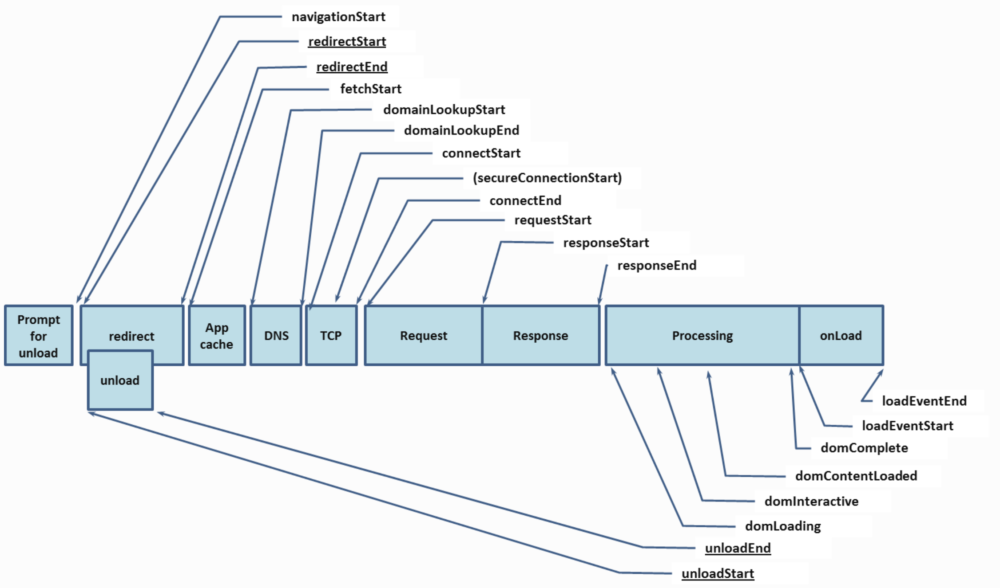

# Events

## 什么是Events？

Events是所有用户在终端发生的事件的集合。

## 一次事件包含：

事件唯一标识（event_id）

发生时间戳（timestamp）

标签（tags）

属性（attributes）

## 会话唯一标识（session_id）:

一次事件的唯一标识信息，关键在于唯一，针对这个值的生成要具有高度的离散性。长度最大256 byte。

## 发生时间戳（timestamp）：

事件发生时间戳。

## 标签（tags）：

支持用户自定义维度，以便于数据的查询，过滤，分组和对数据的标识性跟踪。数据定义参考标签语义。

## 属性（attributes）：

事件属性信息的集合，参考事件属性语义定义，官方标准定义7类事件属性（应用事件，视图事件，操作事件，请求事件，系统事件，异常事件，自定义事件）。

### 应用事件
       
**启动阶段：**记录一次应用的启动，分为冷启动、热启动、首次启动三种类型。冷启动指应用进程从内存加载到完全启动的完整过程；热启动指应用进程已在内存中存在，从后台挂起的状态到重新回到前台运行的过程；首次启动是特殊的冷启动，指应用或应用的最新版本首次在当前设备上运行的冷启动过程。

**退出阶段：**记录一次应用的退出，主要考虑应用退出前持续运行的时间（duration）。

### 视图事件

记录一次视图的加载或退出，分为视图进入与视图退出两种阶段。

### 操作事件

记录一次用户的交互操作，如按钮点击、手势滑动、文本输入等。

### 请求事件

记录一次网络请求的过程与相关性能指标。

**性能（TimingData）**是W3C规范提供的接口获取，其中字段项按照规范提供字段匹配；对应官方链接：https://www.w3.org/TR/navigation-timing/#performancetiming。

### 异常事件

记录一次应用发生的异常情况，包括应用崩溃、JS错误、ANR和卡顿，对应type的取值分别为从1到4。

### 系统事件

记录一次系统相关行为，包括网络切换、应用的前后台切换。具体类型由type字段区分。

### 自定义事件

可以传入任意想要关注和分析的事件与相关数据指标信息。
