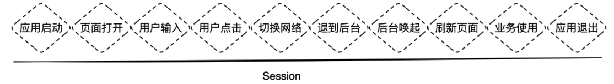
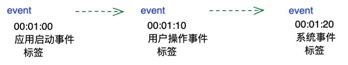

# 会话（Session）

## 什么是会话？

会话是用户在使用终端应用过程中的所有交互内容，它可以诠释用户在应用使用中的全部旅程。

一次会话的开始即代表用户的应用打开，结束可定义为应用的退出。

## 会话的开始和结束？

会话的启动和结束由会话内event决定。

开始为session id相同的event发生最初的时间为起点，结束为event中发生时间最晚的+duration time。

## 一次会话包含：

会话唯一标识（session_id）

标签（tags）

属性（attributes）

事件集（events）

## 会话唯一标识（session_id）:

一次会话的唯一标识信息，关键在于唯一，针对这个值的生成要具有高度的离散性；长度最大256 byte。

## 标签（tags）：

支持用户自定义维度，以便于数据的查询，过滤，分组和对数据的标识性跟踪；数据定义参考标签语义；相同session id的每次session数据包不同tags值追加（append）。

## 属性（attributes）：

会话属性信息的集合，参考会话属性语义定义，官方标准定义3类会话属性（用户信息，应用信息，设备信息）。相同session id的每次session数据包不同attributes值追加（append）。

### 用户信息：

其中包含用户的标识ID和用户的信息；用户ID可由多种属性组合，比如身份证号，手机号，微信号等；用户信息同理，可以包含用户的姓名，住址，特定用户分群及用户画像。

### 应用信息：

应用信息的集合，其中包含应用ID，应用名称，应用版本，渠道；重点提及的是渠道，在移动应用中，渠道可以为应用下载渠道，而小程序和浏览器端，渠道可定义为应用所处容器，如微信，抖音，火狐，谷歌等。

### 设备信息：

应用运行设备的信息集合，其中包括常规设备品牌，型号，RAM大小，ROM大小，CPU厂商型号架构等。

## 事件集（events）：

应用运行交互的事件集合，这些事件包括应用的启动，视图的启动，用户的交互动作，应用的网络性能数据，应用异常数据，应用系统事件，用户自定义事件等；可以看出这些事件完美的诠释了一次用户在应用的所有旅程，因此针对一次上述事件，我们需要组装一次事件（event），多个事件集合（events）的组成变成为一次session。
